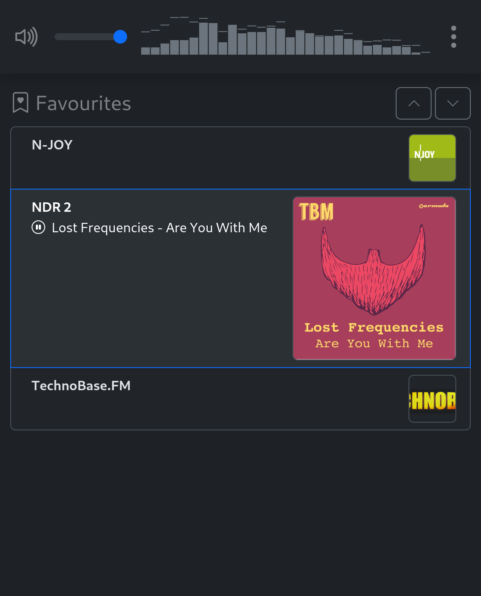

# node_radio
Web frontend for radio stations provided by radio-browser.

- Search Radio-Browser database and add stations to favourites (https://www.radio-browser.info/)
- Spectrum Visualizer (via https://github.com/hvianna/audioMotion.js/)
- Controlable via chrome media session
- Displays song information (via https://gitlab.com/radiolise/radiolise.gitlab.io/-/blob/master/packages/radiolise/readme.md)



## 🚀 Installation 

### Docker compose

1. Create docker-compose.yml
```shsh
touch docker-compose.yml
```

2. Insert into docker-compose.yml (change password to your needs):
```
services:
  node-radio:
    image: kolstr/node-radio
    container_name: node-radio
    restart: unless-stopped
    environment:
      PASSWORD: node-radio
    ports:
      - "3000:3000"
    volumes:
      - ~/node_radio:/app/data
```

3. Start container
```sh
docker compose up -d
```
The application now runs on http://localhost:3000

### Build image manually from repository

1. Clone the repository
```sh
git clone https://git.kolstr.net/kolstr/node-radio.git
```

2. Navigate into the project directory
```sh
cd node-radio
```

3. Create .env file
```shsh
touch .env
```

4. Insert passwort configuration to .env file
```
PASSWORD=node-radio
```

5. Build docker image
```sh
docker build -t node-radio .
```

6. Start container
```sh
docker compose up -d
```

The application now runs on http://localhost:3000

## 📖 Usage
- Initially the favourites file is empty, so you wil see no stations.
- Select the upper right dropdown and search for stations. 
- Select a station from the results and add it to the favourites via the dropdown.

## 🛠️ Technologies & Frameworks Used  
| Category     |  |
|-------------|------------|
| Frontend    |  |
| Backend     |    |
| CI/CD       |  | 